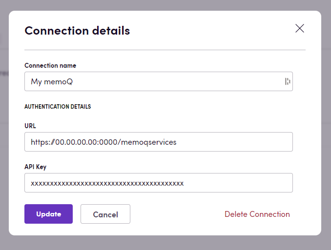

# Blackbird.io memoQ

Blackbird is the new automation backbone for the language technology industry. Blackbird provides enterprise-scale automation and orchestration with a simple no-code/low-code platform. Blackbird enables ambitious organizations to identify, vet and automate as many processes as possible. Not just localization workflows, but any business and IT process. This repository represents an application that is deployable on Blackbird and usable inside the workflow editor.

## Introduction

<!-- begin docs -->

memoQ offers flexible translation and localization management solutions tailored to enterprises, language service providers, and translators. This memoQ application primarily centers around project and file management.

## Before setting up

Before you can connect you need to make sure that:

- You have access to a memoQ instance.
- Your memoQ instance has the API enabled and you have an API key.
- If your memoQ instance requires whitelisting then ask us about our Blackbird _sandbox_ IP addresses.

## Connecting

1.  Navigate to apps and search for memoQ . If you cannot find memoQ then click _Add App_ in the top right corner, select memoQ and add the app to your Blackbird environment.
2.  Click _Add Connection_.
3.  Name your connection for future reference e.g. 'My memoQ'.
4.  Add the URL pointing to your memoQ instance API. Usually this is your instance URL, port with the added `/memoqservices` but this can be different (see image below).
5.  Add your API key. If your memoQ service doesn't require an API key, you can input 'NONE'. We will process it under the hood and exclude it from requests.
6.  Click _Connect_.
7.  Confirm that the connection has appeared and the status is _Connected_.

## Actions

### Analyses

- **Get document/project analysis**.

### Files

- **List project documents** returns a list of all documents related to a specified project.
- **Slice document** slices specific document based on the specified options.
- **Assign document to user** assigns the document to a specific user.
- **Get/delete/overwrite/deliver document**.
- **Import/Export document** uploads/downloads file to the project. Make sure your file name contains extension, otherwise the action will fail.
- **Apply translated content to updated source**.

### XLIFFs

1. **Export document as XLIFF**: Exports and downloads the translation document as XLIFF. If you set 'Use MQXLIFF' optional input to true, it will return an mqxliff file; if it's set to false, it will return an XLIFF 1.2 version file. By default, it is set to false.

2. **Import document as XLIFF**: Uploads and imports a document to a project as XLIFF. This action allows you to upload and import a document to a project as XLIFF, which is a standard for exchanging localization data. Currently, it supports XLIFF versions 1.2 and 2.1, and you can also import mqxliff files.
- 'Re-import document GUID': The unique identifier of the document you want to import. This is required if you want to reimport a document. If specified, the action will try to reimport the document instead of a simple import.

- 'Update segment statuses': An optional input that indicates whether to update segment statuses during the import operation. If set to false, it will only reimport the existing document; if set to true, it will match the IDs of segments and update the segment status to 'Edited' if the target value of the segment is different, and also update the target text of the segment.

- 'Path to set as import path': An optional input that represents the path to set as the import path. If you want to reimport document it's required, you can find this path from **Export document as XLIFF** action by exporting specific file, and you can use 'Export path' property here (it looks like: '\\en-uk_ukr.xliff')

### Groups

- **List groups** returns a list of all groups.

### Packages

- **Create delivery package** creates a new delivery package from document IDs.
- **Deliver package** delivers a specific package.

### Projects

- **List projects** returns a list of all projects.
- **Get/create/delete/distribute project**.
- **Create project from package/template** creates a new project based on a specified template/package.
- **Add target language to project** adds target language to a specific project.
- **Pretranslate documents** This action allows you to pretranslate documents in a specific project. Pretranslation is a process where the system automatically fills in the translations for segments in a document based on certain criteria. This can significantly speed up the translation process. Parameters:  
1. **Document GUIDs**: This parameter is used to specify the unique identifiers of the documents you want to pretranslate. If you don't specify any document GUIDs, the action will pretranslate all documents in the project.
2. **Target languages**: This parameter is used to specify the target languages for pretranslation. If you don't specify any target languages, the action will pretranslate all target languages in the project.
2. **Lock**: This optional parameter, when set to true, locks the pretranslated segments to prevent further editing. By default, this is set to true.
3. **Confirm lock pretranslated**: This optional parameter determines the state of segments that should be confirmed and locked during pretranslation. By default, this is set to 'ExactMatch'.
4. **Pretranslate lookup behavior**: This optional parameter determines the behavior of the pretranslation lookup process.  
5. **Use MT**: This optional parameter, when set to true, enables the use of Machine Translation (MT) during pretranslation.  
6. **Translation memories GUIDs**: This optional parameter is used to specify the unique identifiers of the translation memories to be used during pretranslation.  
7. **Include numbers**: This optional parameter, when set to true, includes numbers in the pretranslation. By default, this is set to true.  
8. **Change case**: This optional parameter, when set to true, changes the case of the pretranslated text. By default, this is set to false.  
9. **Include auto translations**: This optional parameter, when set to true, includes auto translations in the pretranslation. By default, this is set to true.  
10. **Include fragments**: This optional parameter, when set to true, includes fragments in the pretranslation. By default, this is set to true.  
11. **Include non-translatables**: This optional parameter, when set to true, includes non-translatable text in the pretranslation. By default, this is set to true.  
12. **Include term bases**: This optional parameter, when set to true, includes term bases in the pretranslation. By default, this is set to true.  
13. **Minimum coverage**: This optional parameter is used to specify the minimum coverage for pretranslation. By default, this is set to 50.  
14. **Coverage type**: This optional parameter is used to specify the type of coverage for pretranslation. By default, this is set to 'Not full'.  
15. **Only unambiguous matches**: This optional parameter, when set to true, only includes unambiguous matches in the pretranslation. By default, this is set to true.
16. **Final translation state**: This optional parameter is used to specify the final translation state for pretranslated segments. By default, this is set to 'No change'.

### Translation memories

- **List translation memories** returns a list of all translation memory.
- **Get/create/update/delete**.
- **Import TMX file** imports TMX file to the translation memory.
- **Import translation memory scheme from XML** imports translation memory metadata scheme from an XML file.

### Term bases

- **Import glossary** imports a term base.
- **Export glossary** exports an existing term base. This action accepts an optional input parameter called _Include forbidden terms_ which defaults to _False_. When set to _False_, terms with _Forbidden_ status are excluded from the resulting export.

**Import glossary** and **Export glossary** support both regular term bases and QTerm. It's essential to note that the current implementation only facilitates basic imports/exports, covering fundamental information like terms, languages, and definitions. However, additional details such as domain, usage examples, client, project, and other details are not included in the glossaries.

Another important consideration is that our glossaries implementation adheres to the ISO 639-1 standard language codes, in contrast to memoQ. If there is no corresponding ISO 639-1 language code for a language supported by memoQ, our glossaries will utilize memoQ's ISO 639-3 language code. This can result in incompatibility with other systems if such languages are present in a glossary. However, it's worth mentioning that you will still be able to manipulate these glossaries within memoQ.

### Users

- **List users** returns a list of all users.
- **Get/create/delete user**.

## Events

- **On document delivered** is triggered when any project document was delivered.

## Missing features

In the future we can add actions for:

- Tasks
- Resources

## Feedback

Feedback to our implementation of memoQ is always very welcome. Reach out to us using the [established channels](https://www.blackbird.io/), or create an issue.

<!-- end docs -->
